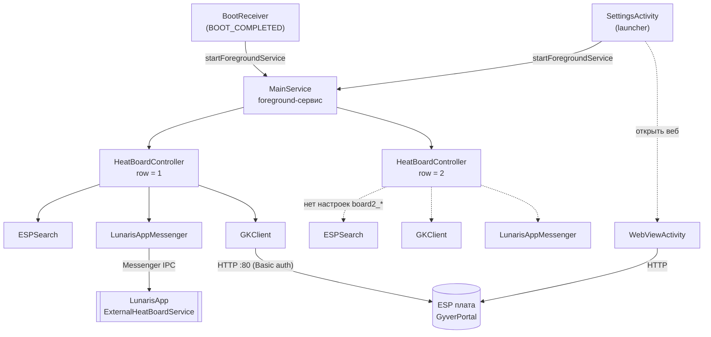
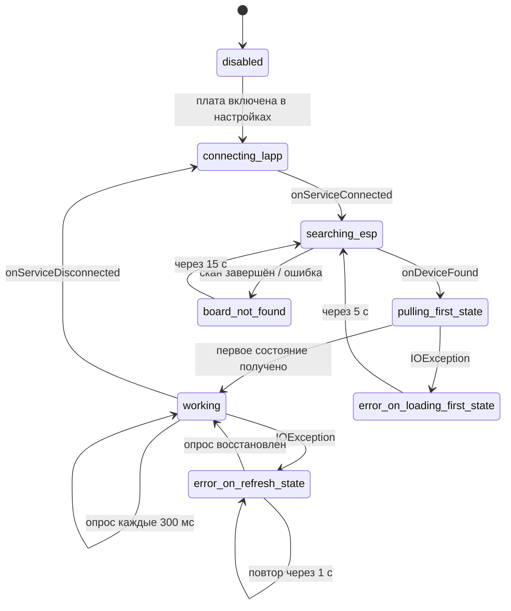
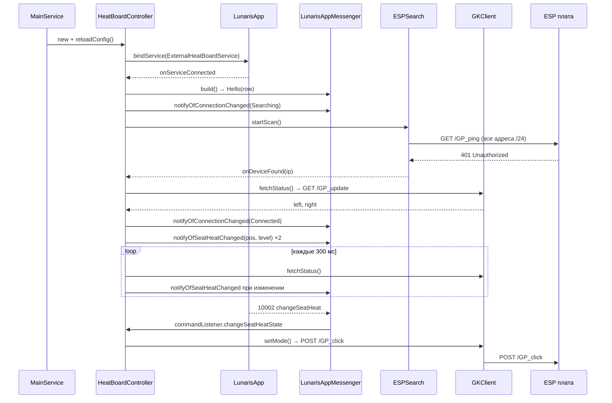

# GK_Heats

## Отступление
Этот README писала ИИ, т.к. мне было лень, простите =)

Части этого проекта (`LunarisAppMessenger`) могут быть использованы как example по интеграции других плат в LunarisApp.

Пока обновление LunarisApp с поддержкой сторонних плат не вышло API может добавляться / меняться

Готовые APK можно взять в app/release/

## Вступление

Android-приложение — мост между платами подогрева сидений **@gkmikhalych** и приложением автомагнитолы **LunarisApp**.

Плата подогрева — это ESP с веб-интерфейсом на GyverPortal, доступным по HTTP в локальной сети. LunarisApp умеет показывать и переключать подогрев сидений, но не знает про эту плату. GK_Heats закрывает этот разрыв: находит плату в сети, постоянно опрашивает её состояние, транслирует изменения в LunarisApp и применяет обратные команды на плату.

Работает как постоянный foreground-сервис, автостарт по загрузке устройства. Собственного интерфейса управления подогревом нет — только экран настроек и встроенный WebView с родным веб-интерфейсом платы.

## Как это работает

```
                 HTTP (Basic auth, порт 80)          Messenger IPC
  Плата ESP  <-------------------------------> GK_Heats <-----------> LunarisApp
 (GyverPortal)   /GP_ping /GP_update /GP_click            ru.mark99.carapp
```

Владение компонентами (что кого создаёт):



1. `MainService` стартует по `BOOT_COMPLETED` (или вручную из настроек) и поднимает foreground-уведомление.
2. Для каждой платы создаётся `HeatBoardController` на отдельном потоке.
3. Контроллер биндится к сервису LunarisApp, затем запускает поиск платы в подсети.
4. `ESPSearch` перебирает адреса подсети /24 и опознаёт плату по ответу **HTTP 401** на `GET /GP_ping`.
5. После находки читается первое состояние, затем идёт опрос каждые 300 мс. Изменения уровней отправляются в LunarisApp.
6. Команды из LunarisApp применяются на плату через `POST /GP_click`.

### Состояния контроллера

| Состояние                      | Значение                                            |
|--------------------------------|-----------------------------------------------------|
| `disabled`                     | передача выключена в настройках                     |
| `connecting_lapp`              | ожидание бинда к LunarisApp, ретрай каждые 3 с      |
| `searching_esp`                | сканирование подсети                                |
| `pulling_first_state`          | чтение первого состояния платы                      |
| `working`                      | штатный опрос                                       |
| `board_not_found`              | плата не найдена, повторное сканирование через 15 с |
| `error_on_loading_first_state` | ошибка первого чтения, повторный поиск через 5 с    |
| `error_on_refresh_state`       | ошибка опроса, повтор через 1 с                     |

Переходы (упрощённо, для одной платы):



## Схемы и графы вызовов

### Сценарий запуска и штатной работы одной платы



### Граф вызовов ключевых методов

```mermaid
graph LR
    onCreate["MainService.onCreate"] --> reloadConfig["HBC.reloadConfig"]
    reloadConfig --> stop["HBC.stop"]
    reloadConfig --> connect["HBC.connectToLunarisApp"]
    connect --> bind["MainService.bindService"]
    bind --> onConnected["onServiceConnected"]
    onConnected --> build["LunarisAppMessenger.build → sendHello"]
    onConnected --> searchEsp["HBC.searchEsp"]
    searchEsp --> startScan["ESPSearch.startScan"]
    startScan --> checkDevice["ESPSearch.checkDevice (GET /GP_ping)"]
    checkDevice --> onDeviceFound["HBC.onDeviceFound"]
    onDeviceFound --> loadFirst["HBC.loadFirstState"]
    loadFirst --> fetch1["GKClient.fetchStatus (GET /GP_update)"]
    loadFirst --> periodic["HBC.periodicallyUpdateState"]
    periodic --> fetch2["GKClient.fetchStatus"]
    periodic --> periodic
    rx["LunarisApp → commandListener"] --> setMode["GKClient.setMode (POST /GP_click)"]
```



### Потоки

- **Main looper** — только служебные вещи: `onCreate`/`onDestroy` сервиса, колбэки `ESPSearch` (публикуются через `Handler(Looper.getMainLooper())`), UI настроек.
- **Поток платы** — у каждого `HeatBoardController` свой `HandlerThread`. На нём выполняются `reloadConfig`, поиск, синхронные HTTP-вызовы `GKClient` и цикл опроса. Блокирующий сетевой ввод-вывод не задевает UI.
- **Пул сканера** — `ESPSearch` использует пул из 20 потоков для параллельного перебора адресов; результат постится обратно на main looper, а сам пул останавливается через отдельный daemon-поток, чтобы не словить ANR.
- **Поток мессенджера** — `LunarisAppMessenger` наследует `Handler` и работает на собственном `HandlerThread`; входящие IPC-сообщения от LunarisApp приходят на него.

## Протокол платы

HTTP без TLS, порт 80, HTTP Basic auth. Поэтому в манифесте включён `network_security_config` с `cleartextTrafficPermitted="true"`.

| Назначение                  | Метод | Путь                                     |
|-----------------------------|-------|------------------------------------------|
| Обнаружение (ожидается 401) | GET   | `/GP_ping`                               |
| Чтение уровней              | GET   | `/GP_update?modeWarmLeft,modeWarmRight=` |
| Установка левого            | POST  | `/GP_click?modeWarmLeft=<0..3>`          |
| Установка правого           | POST  | `/GP_click?modeWarmRight=<0..3>`         |
| Веб-интерфейс платы         | GET   | `http://<host>/`                         |

Ответ `/GP_update` парсится побайтово: первый байт — уровень левого сиденья, третий — правого (второй байт разделитель).

Нумерация уровней у платы и у LunarisApp обратная, поэтому `GKClient.convStateInt` переворачивает её в обе стороны: `1 ↔ 3`, `2 ↔ 2`, `3 ↔ 1`, остальное → `0`.

Тайминги: таймауты HTTP 1000 мс, таймаут пробы при сканировании 500 мс (20 потоков, watchdog 20 с), опрос 300 мс.

## Протокол с LunarisApp

Явный бинд к `ru.mark99.carapp` / `ru.mark99.carapp.ExternalHeatBoardService` с флагом `BIND_AUTO_CREATE`, обмен через `android.os.Messenger` — целочисленный `what` плюс `Bundle`.

| Код     | Направление  | Константа                        | Смысл                                  | Payload                    |
|---------|--------------|----------------------------------|----------------------------------------|----------------------------|
| `10000` | → LunarisApp | `CommandTXHello`                 | Hello (в сообщении ставится `replyTo`) | `row` = `first` / `second` / `both` |
| `10001` | → LunarisApp | `CommandTXNotifyOfHeatStateChanged` | Изменился уровень подогрева         | `seatPos`, `seatHeatMode`  |
| `10003` | → LunarisApp | `CommandTXNotifyOfConnectionChanged` | Изменилось состояние связи         | `state`                    |
| `10010` | → LunarisApp | `CommandTXClientDisconnected`    | Клиент отключился                      | —                          |
| `10002` | ← LunarisApp | `CommandRXChangeSeatHeat`        | Установить уровень подогрева           | `seatPos`, `seatHeatMode`  |

Из входящих сообщений `LunarisAppMessenger.handleMessage` обрабатывает только `10002`; любой другой `what` логируется как `Unknown event received` и игнорируется.

Поле `row` в Hello (`10000`) формируется в `sendHello` из индекса контроллера через `switch`: `1` → `first`, `2` → `second`, любой другой индекс → `both`. Значение `both` описывает плату, которая обслуживает сразу оба ряда сидений.

Позиции сидений — битовые флаги: `1` левое переднее, `4` правое переднее, `16` левое заднее, `64` правое заднее.
Режимы: `0` выкл, `1..3` уровни, `4` авто.
Состояния связи: `0` disabled, `1` connected, `2` searching, `3` error.

## Структура

```
app/src/main/java/ru/mark99/gk_heats/
├── MainService.java            foreground-сервис, владелец контроллеров плат
├── HeatBoardController.java    конечный автомат одной платы, свой HandlerThread
├── ESPSearch.java              сканер подсети /24, опознание платы по HTTP 401
├── GKClient.java               OkHttp-клиент платы (чтение/запись уровней)
├── LunarisAppMessenger.java    IPC-протокол с LunarisApp
├── SettingsActivity.java       экран настроек и живой статус
├── WebViewActivity.java        WebView с веб-интерфейсом платы
├── BootReceiver.java           автостарт сервиса по BOOT_COMPLETED
└── Utils.java                  уведомление foreground-сервиса

app/src/main/res/
├── xml/root_preferences.xml         экран настроек
├── xml/network_security_config.xml  разрешение cleartext HTTP
├── layout/settings_activity.xml
├── layout/activity_web_view.xml
└── values/                          themes (крупный текст 24sp для ГУ), strings, colors, arrays

gk_web/                              справочный дамп веб-интерфейса платы (GyverPortal)
├── main.html                        страница «Lunaris Warm» — источник имён modeWarmLeft/Right и путей GP_*
├── GP_SCRIPT.js                     клиентский скрипт GyverPortal (GP_update / GP_click / GP_ping)
└── GP_CANVAS.js
```

Папка `gk_web/` не участвует в сборке APK — это сохранённая копия родного веб-интерфейса платы, оставленная как референс протокола. Приложение всегда загружает живую страницу с платы (`http://<host>/`).

## Настройки

Экран настроек — единственная активность в лаунчере (`@gkmikhalych`). Хранение в `SharedPreferences` по умолчанию.

| Ключ              | Тип           | Описание                                                                |
|-------------------|---------------|-------------------------------------------------------------------------|
| `state_service`   | клик          | состояние сервиса; клик запускает его, если не запущен                  |
| `board1_login`    | текст         | логин Basic auth, по умолчанию `Lunaris`                                |
| `board1_password` | текст         | пароль Basic auth, по умолчанию `1234554321`                            |
| `board1_enabled`  | переключатель | включить передачу в LunarisApp (доступен только при запущенном сервисе) |
| `board1_state`    | только чтение | живой статус контроллера, обновляется каждые 200 мс                     |
| `board1_open_web` | клик          | открыть веб-интерфейс платы в WebView (активен, когда плата найдена)    |

## Сборка
Собирается как есть в текущем виде в Android Studio с настройками по умолчанию.

Требуется JDK 21 (Gradle-демон настроен на toolchain 21 в `gradle/gradle-daemon-jvm.properties`).

```bash
./gradlew assembleDebug     # или assembleRelease
```

APK попадает в `app/build/outputs/apk/<type>/` под именем `GKHeats-<версия>-<R|D>.apk`, где версия — дата сборки в формате `yyyy.MM.dd`.

| Параметр     | Значение      |
|--------------|---------------|
| Gradle / AGP | 9.7.1 / 9.3.2 |
| Java         | 21            |
| `compileSdk` | 37            |
| `minSdk`     | 28            |
| `targetSdk`  | 28            |

`targetSdk 28` выбран осознанно: на более новых уровнях API пришлось бы объявлять `foregroundServiceType` и обходить ограничения на запуск сервисов из фона, что для постоянно работающего сервиса в автомагнитоле только мешает. По этой же причине в манифесте стоит `tools:ignore="ForegroundServicesPolicy"`, а в коде `@SuppressLint("ForegroundServiceType")`. Приложение не предназначено для публикации в Google Play.

Зависимости: `androidx.appcompat`, `androidx.preference`, `androidx.activity`, `material`, `com.squareup.okhttp3:okhttp` 5.5.0.

## Разрешения

| Разрешение                                       | Зачем                                |
|--------------------------------------------------|--------------------------------------|
| `INTERNET`                                       | HTTP-запросы к плате                 |
| `ACCESS_WIFI_STATE`                              | определение подсети через `DhcpInfo` |
| `CHANGE_WIFI_STATE`                              | работа с Wi-Fi-подключением          |
| `ACCESS_COARSE_LOCATION`, `ACCESS_FINE_LOCATION` | доступ к данным Wi-Fi-сети           |
| `RECEIVE_BOOT_COMPLETED`                         | автостарт сервиса                    |
| `FOREGROUND_SERVICE`                             | постоянно работающий сервис          |

## Текущие ограничения

- **Вторая плата (задний ряд) не подключена к UI.** В коде `MainService` создаёт `HeatBoardController(2)`, но настроек `board2_*` в `root_preferences.xml` нет, поэтому `board2_enabled` всегда читается как `false` и контроллер остаётся в `disabled`. Логика заднего ряда готова, не хватает только настроек.
- Значение `row = both` пока заведено только в Hello-сообщении. `MainService` создаёт лишь контроллеры с индексами `1` и `2`, поэтому ветка `both` в `sendHello` в штатном режиме не срабатывает. К тому же расчёт позиций сидений в `HeatBoardController` различает только `row == 1` (передний ряд) и всё остальное (задний ряд, флаги `16`/`64`), так что обслуживание обоих рядов одним контроллером ещё не реализовано полностью.
- `board1_row` в настройках — информационный, ряд жёстко определяется индексом контроллера.
- Режим `4` (авто) из LunarisApp не имеет соответствия на плате и превращается в `0` (выключено) в `convStateInt`.
- `arrays.xml` (`row_entries` / `row_values`) и `colors.xml` не используются — остались от варианта с выбором ряда через `ListPreference`.
- Пользовательские строки захардкожены в коде и XML по-русски, локализации нет.
- Поиск платы работает только в подсетях /24.
